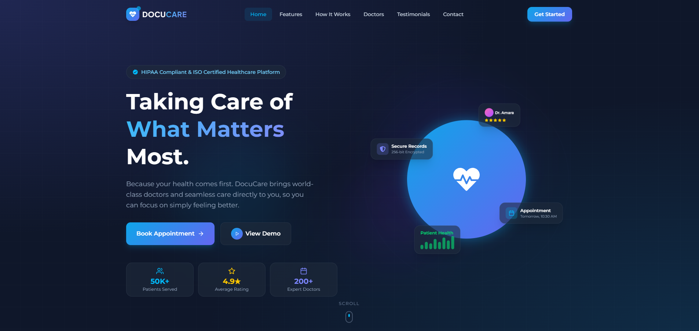

# 🏥 DocuCare Management



## 📖 Short Description
DocuCare Management is a modern, responsive, and beautifully animated frontend application designed to transform doctor-patient relationships through smart, secure, and accessible healthcare technology. It features a stunning user interface built with the latest React and Tailwind CSS, enriched with smooth animations to provide a seamless user experience.

## 🌐 Live Project
Experience the application live: [DocuCare Management Live](https://docu-care.netlify.app/)

## 💻 Technology Stack
This project leverages the following core technologies:
- **React**: `^19.2.0`
- **Vite**: `^7.3.1` (Build Tool)
- **Tailwind CSS**: `^4.2.0`
- **React Router DOM**: `^7.13.0`

## 📦 Extra Packages & Libraries
To enhance the visual appeal and functionality, several external packages were utilized:
- **framer-motion (`^12.34.3`)**: Used for fluid, component-level animations and UI transitions.
- **gsap (`^3.14.2`)**: Used for complex, timeline-based hero animations and scroll effects.
- **react-icons (`^5.5.0`)**: Used to provide a professional and scalable vector icon system across the entire application interface.

## 🚀 Setup Instructions
Follow these steps to run the project locally on your machine without any errors.

### Prerequisites
Make sure you have [Node.js](https://nodejs.org/) installed on your system.

### Installation
1. **Clone the repository:**
   ```bash
   git clone https://github.com/saidebinsabid/docucare-management.git
   cd docucare-management
   ```

2. **Install all dependencies:**
   This project relies on external packages like `framer-motion`, `gsap`, and `react-icons`. Running the following command will install React along with all the necessary dependencies mentioned in the `package.json` file.
   ```bash
   npm install
   ```

3. **Start the development server:**
   ```bash
   npm run dev
   ```

4. **Open in browser:**
   Open your browser and navigate to the local URL provided in your terminal (typically `http://localhost:5173/`).

## 📫 Get in Touch
Thank you for checking out my project! I hope you find the user interface and animations inspiring. 

If you have any questions, feedback, or would like to discuss potential opportunities, please feel free to reach out. 
📧 **Email me at**: [ssaidebin1@gmail.com](mailto:ssaidebin1@gmail.com)
